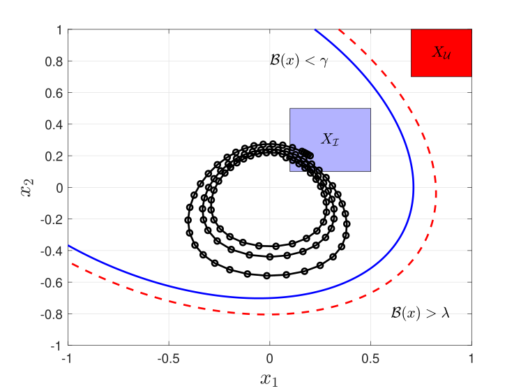
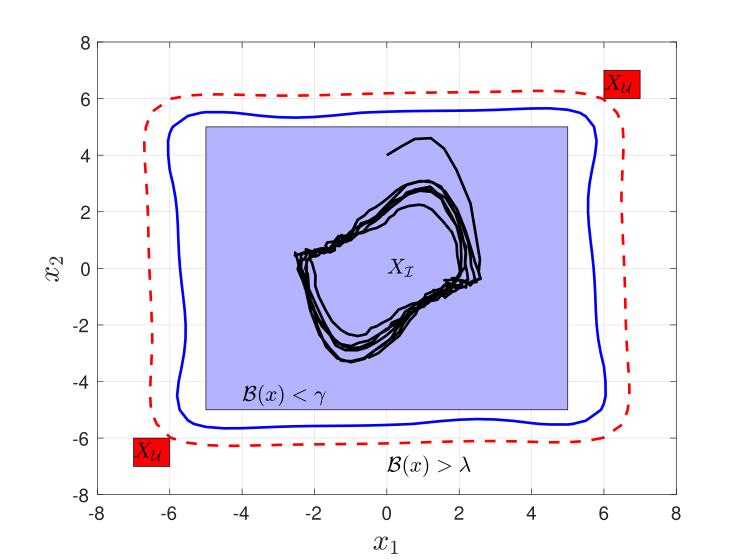
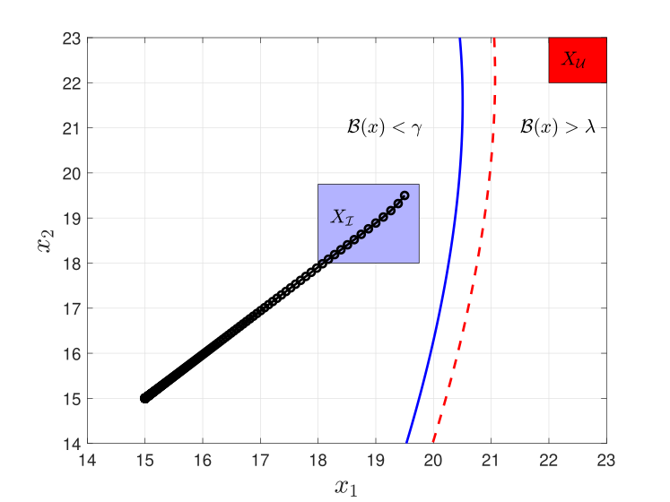
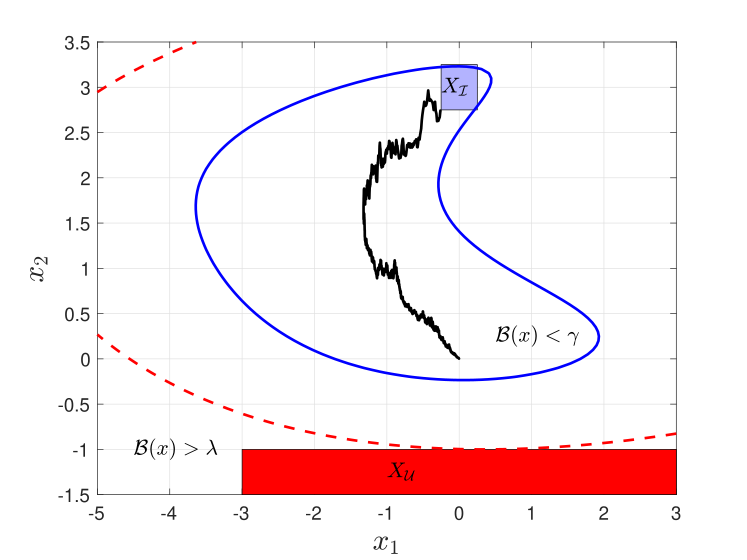
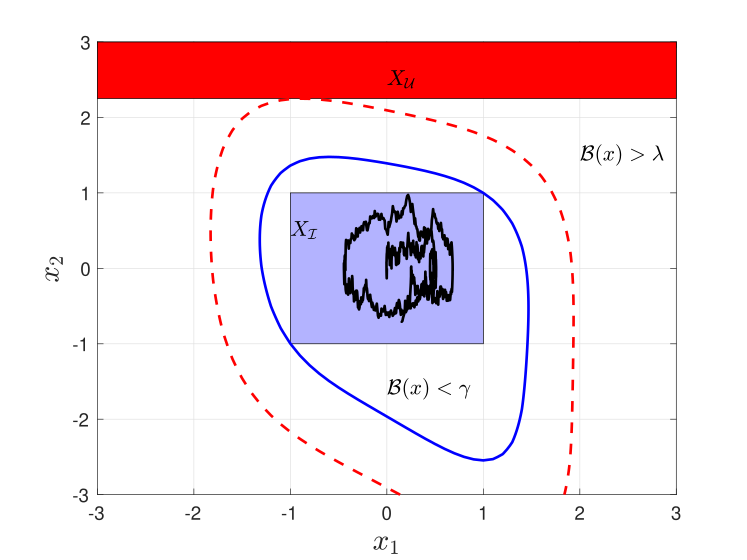

# PRoTECT

[](https://zenodo.org/doi/10.5281/zenodo.11085376)[![CC BY 4.0][cc-by-shield]][cc-by]

<p align="center">


</p>

PRoTECT is an open-source software tool, for the parallelized
construction of safety barrier certificates (BCs) for nonlinear polynomial systems. This tool aims to verify safety properties for four classes of dynamical systems: (i) discrete-time stochastic systems (dt-SS), (ii) discrete-time deterministic systems (dt-DS), (iii) continuous-time stochastic systems (ct-SS), and (iv) continuous-time deterministic systems (ct-DS). PRoTECT is implemented in Python as an application programming interface (API), offering users the flexibility to interact either through its user-friendly graphic user interface (GUI) or via function calls from other Python programs. PRoTECT leverages parallelism across different barrier degrees to efficiently search for
a feasible BC. Additionally, PRoTECT employs sum-of-squares (SOS) optimization programs to systematically search for polynomial-type BCs.

We have provided Youtube tutorial videos to help understand how to use PRoTECT [here](https://www.youtube.com/playlist?list=PL50OJg3FHS4ctLItbuyT5Hqqn6HQzJ_g-).

## Table of Contents
- [Artifact Evaluation](#Artifact-Evaluation)
- [Installation](#installation)
- [Examples](#examples)
- [Related Paper](#related-paper)
- [Reporting Bugs](#reporting-bugs)
- [License](#license)
- [Youtube Videos about PRoTECT](https://www.youtube.com/playlist?list=PL50OJg3FHS4ctLItbuyT5Hqqn6HQzJ_g-)

## Artifact Evaluation

If you are a reviewer for the AE committee, the instructions for how to install and reproduce the results of our paper can be found [here](./Artifact_Evaluation_Instructions.pdf). As the tool uses a GUI, we recommend running it on the Virtual Machine provided by the AE Committee that can be found [here on Zenodo](https://zenodo.org/records/10928976), the instructions are partially tailored for this VM. Assuming PRoTECT is installed in the home directory then by navigating to the [bash-scripts](./bash-scripts) folder you can simply run:

`./install_ubuntu22_PRoTECT_and_FOSSIL.sh`

to install all necessary dependencies and update the PYTHONPATH, etc. apropriately.

## Installation

If you choose to use Mosek you will also need a license that can be acquired [here](https://www.mosek.com/license/request/?i=acp) (free for academics).

If using Ubuntu, we have provided an installation script that automatically installs all prerequisites and sets up the PYTHONPATH assuming the repository is cloned into the home directory:

`cd ~/PRoTECT/bash-scripts`

`./install_ubuntu22_PRoTECT.sh`

It is also easy to install the tool manually. We assume the user has python3 and pip installed on their machine. To install necessary dependencies, run from the directory containing the repository: <br><br>`pip install -r requirements.txt`

To use PRoTECT via its GUI, simply navigate a terminal to the current folder and then run `python3 main.py`. You can import pre-configured examples into the GUI from the folder [GUI_config_files](./ex/GUI_config_files/) by clicking the button *Import Config*. You can also run the examples for the [deterministic](./ex/benchmarks-deterministic/PRoTECT-versions/) and [stochastic](./ex/benchmarks-stochastic/) systems from the respective folders with `python3 <example-name>.py` (You may also need to temporarily add PRoTECT to your PATH using `export PYTHONPATH=/<path-to-PRoTECT>/PRoTECT:$PYTHONPATH` before running the examples this way, or permanently add it to your PATH by appending `export PYTHONPATH=$PYTHONPATH:/<path-to-PRoTECT>/PRoTECT` to the end of the file `~/.profile`, or equivalent, and restarting your computer). Helpful information about which files to adjust for your specific machine to edit the PYTHONPATH can be found [here](https://stackoverflow.com/questions/3402168/permanently-add-a-directory-to-pythonpath?newreg=2db2ca3b38664e6cbc6121ba55522f63).

We have provided some tutorial videos which cover the basics of installation and using PRoTECT which can be found [here](https://www.youtube.com/playlist?list=PL50OJg3FHS4ctLItbuyT5Hqqn6HQzJ_g-).

We have also included a Dockerfile which can run the API scripts for PRoTECT with a default solver of CVXOPT, but cannot support the GUI. To build and run this Dockerfile, use the following commands:

`docker build -t protect .`

`docker run --rm -it --name protect protect`

You can add the Mosek license into the Docker image by adapting the following command:

`docker cp <license-file-on-host-machine> protect:<location-for-license-on-Docker-image>`

## Examples

We present some selected examples graphically to demonstrate some use cases of PRoTECT. All the examples can be found in the folder [ex](./ex/) where the deterministic case studies also include the code to run them on the tool FOSSIL for comparison (the models in [models.py](./ex/benchmarks-deterministic/FOSSIL-versions/models.py) should be copied into the equivalent FOSSIL file models.py).

In addition configuration files for all of the examples can be imported in the GUI for analysis if desired, these can be found in the folder [GUI_config_files](./ex/GUI_config_files/).

### Example 1 - 2D Jet Engine (ct-DS)
<p align="center">

</p>
  
A continuous-time deterministic system of a 2D jet engine is verified over an infinite-time horizon with the goal of never reaching the red avoid region, see [ex2_jet_engine_ct_DS.py](./ex/benchmarks-deterministic/PRoTECT-versions/ex2_jet_engine_ct_DS.py).

### Example 2 - 2D Van der Pol oscillator (dt-SS)
<p align="center">

</p>
  
A continuous-time deterministic system of a 2D Van der Pol oscillator is verified over a finite-time horizon with the goal of not reaching the red avoid region with some confidence, see [ex2_van_der_pol_oscillator_dt_SS_uniform.py](./ex/benchmarks-stochastic/ex2_van_der_pol_oscillator_dt_SS_uniform.py).

### Example 3 - 2D Two Room System (dt-DS)
<p align="center">

</p>
  
A discrete-time deterministic system of a two-room temperature system that is verified over an infinite time horizon with the goal of never the red avoid region, see [ex2_TwoRoomTemp_dt_DS.py](./ex/benchmarks-deterministic/PRoTECT-versions/ex2_TwoRoomTemp_dt_DS.py).

### Examples 4 & 5 - 2D Linear and Nonlinear Systems (ct-SS)
<p align="center">


</p>
  
Two 2D continuous-time deterministic systems with Linear (left) and Nonlinear (right) dynamics are verified over a finite-time horizon with the goal of not reaching the red avoid region with some confidence, see [ex2_A1linear_ct_SS.py](./ex/benchmarks-stochastic/ex2_A1linear_ct_SS.py) and [ex2_nonlinear_ct_SS.py](./ex/benchmarks-stochastic/ex2_nonlinear_ct_SS.py).

## Related Paper

The arXiv version of the paper is located [here](https://arxiv.org/abs/2404.14804).

### Authors
- [Ben Wooding](https://woodingben.com)
- [Viacheslav Horbanov](https://www.linkedin.com/in/slavixg/)
- [Abolfazl Lavaei](https://lavaei-cps.de/)

### Citing PRoTECT
```
@misc{wooding2024protect,
      title={PRoTECT: Parallelized Construction of Safety Barrier Certificates for Nonlinear Polynomial Systems}, 
      author={Ben Wooding and Viacheslav Horbanov and Abolfazl Lavaei},
      year={2024},
      eprint={2404.14804},
      archivePrefix={arXiv},
      primaryClass={eess.SY}
}
```

## Reporting Bugs
If you encounter any issues or have feedback, please open an issue in the repository. We appreciate your input and will address it as soon as possible.

## License
This work is licensed under a
[Creative Commons Attribution 4.0 International License][cc-by].

[![CC BY 4.0][cc-by-image]][cc-by]

[cc-by]: http://creativecommons.org/licenses/by/4.0/
[cc-by-image]: https://i.creativecommons.org/l/by/4.0/88x31.png
[cc-by-shield]: https://img.shields.io/badge/License-CC%20BY%204.0-lightgrey.svg
