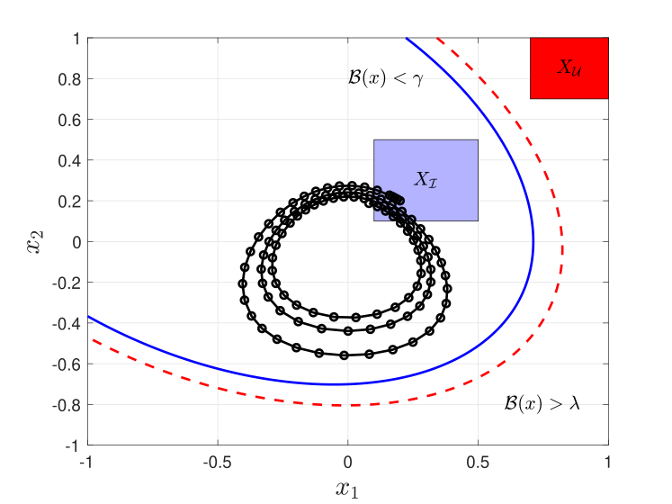
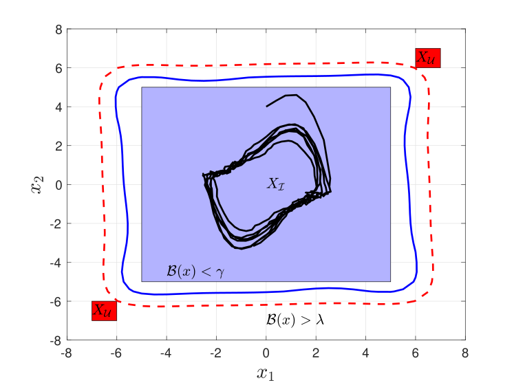
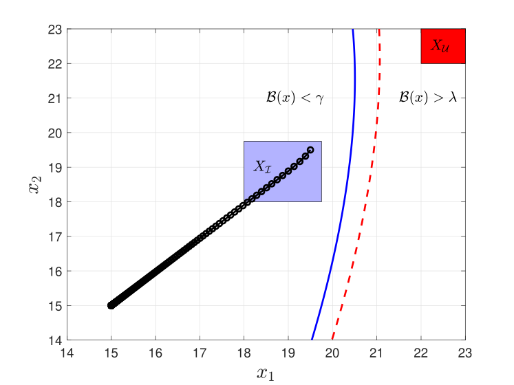
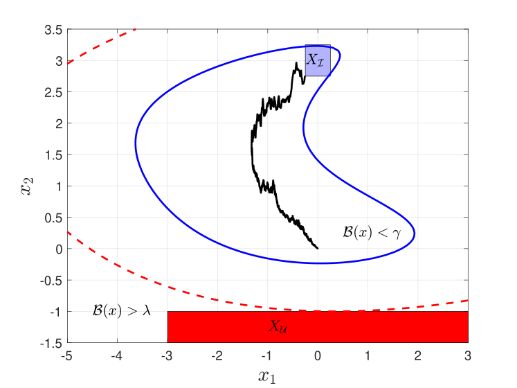
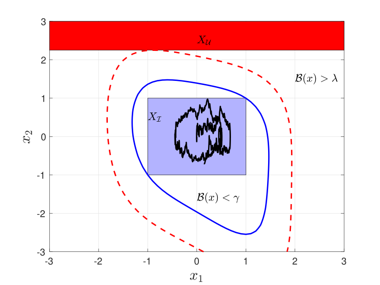

# PRoTECT

[](https://zenodo.org/doi/10.5281/zenodo.11085376)[![CC BY 4.0][cc-by-shield]][cc-by]

<p align="center">


</p>

PRoTECT is an open-source software tool, for the parallelized
construction of safety barrier certificates (BCs) for nonlinear polynomial systems. This tool aims to verify safety properties for four classes of dynamical systems: (i) discrete-time stochastic systems (dt-SS), (ii) discrete-time deterministic systems (dt-DS), (iii) continuous-time stochastic systems (ct-SS), and (iv) continuous-time deterministic systems (ct-DS). PRoTECT is implemented in Python as an application programming interface (API), offering users the flexibility to interact either through its user-friendly graphic user interface (GUI) or via function calls from other Python programs. PRoTECT leverages parallelism across different barrier degrees to efficiently search for
a feasible BC. Additionally, PRoTECT employs sum-of-squares (SOS) optimization programs to systematically search for polynomial-type BCs.

We have provided Youtube tutorial videos to help understand how to use PRoTECT [here](https://www.youtube.com/playlist?list=PL50OJg3FHS4ctLItbuyT5Hqqn6HQzJ_g-).

You may experience the automatic installation tools don't work for the latest Python versions, Python 3.10 is known to work and is recommended.

## Table of Contents
- [What's New in v2](#whats-new-in-v2)
- [Artifact Evaluation](#Artifact-Evaluation)
- [Installation](#installation)
- [Examples](#examples)
- [ARCH-COMP 2026 NLN Submission](#arch-comp-2026-nln-submission)
- [Related Paper](#related-paper)
- [Reporting Bugs](#reporting-bugs)
- [License](#license)
- [Youtube Videos about PRoTECT](https://www.youtube.com/playlist?list=PL50OJg3FHS4ctLItbuyT5Hqqn6HQzJ_g-)

## What's New in v2

PRoTECT v2 extends the original tool with several solver-side and modelling
upgrades, while preserving full backwards compatibility with v1. The v1 entry
points (`src/functions/ct_DS.py`, `dt_DS.py`, `ct_SS.py`, `dt_SS.py`) are
unchanged; the new functionality lives in additional modules under
[`src/functions/`](./src/functions/).

| v2 module | What it adds |
| --- | --- |
| `ct_DS_robust.py` | Drop-in replacement for `ct_DS` that searches a barrier `B(x)` valid for **every** parameter `p ∈ [P_lo, P_hi]` via a parameter-box S-procedure on the Lie-derivative SOS constraint. Adds `margin` (enforces `λ - γ ≥ margin` for a verifiable separation gap) and `mosek_tol` (forwards tighter MOSEK feasibility tolerances). |
| `ct_DS_reach_avoid.py`, `ct_DS_finite_time.py`, `ct_DS_hybrid.py`, `ct_DS_piecewise_sequence.py`, `ct_DS_v2.py` | New encodings for reach-avoid, finite-time-horizon, hybrid-mode, and piecewise-input safety problems. |
| `ct_SS_subgaussian.py`, `stochastic_ext.py` | Sub-Gaussian-noise barriers and additional stochastic encodings on top of the v1 `ct_SS`. |
| `solve_helpers.py` | High-level `solve_safety_problem` wrapper: sweeps a degree list with MOSEK first, falls back to CVXOPT only if MOSEK can't produce any barrier. |
| `sos_validate.py` | Post-solve numerical validator. Cleans MOSEK's Gram matrix (rounding-to-zero + PSD projection), substitutes the post-solve decision-variable values, and reports the residual at MOSEK's true feasibility precision (~10⁻⁸). Distinguishes solver-numerical noise from genuine spec violations. |
| `relaxations.py`, `sinc_relaxation.py`, `pade.py` | Polynomial relaxations of trigonometric / rational dynamics: `sin(θ) → θ · σ(θ)` with `σ` treated as a robust uncertain parameter, and Padé approximants for non-polynomial transfer functions. |
| `block_decomp.py`, `sparse_sos.py` | Block / sparse SOS decomposition routines for higher-dimensional barriers. |
| `dae.py`, `slow_fast.py` | Differential-algebraic and slow-fast system encodings. |
| `disturbance.py`, `nn_control.py`, `vertex_enumeration.py` | Disturbance handling, neural-network control wrapping, and vertex enumeration on the safe set. |
| `figure_export.py`, `result_export.py`, `sets.py` | Tikz-friendly figure export, ARCH-COMP-portal-compatible result export, and helper set utilities. |

### Highlights for end users

* **Robust certificates over uncertain parameters.** `ct_DS_robust` lets you give a parameter box `[P_lo, P_hi]` and search for a single barrier valid for the whole box, without lifting parameters into the state.
* **Numerical health check on every solve.** `sos_validate` post-mortems the Gram matrix and tells you whether MOSEK's certificate is *internally consistent* — it surfaces "the spec is genuinely on the edge of infeasibility" rather than letting you mistake numerical-tolerance noise for a real violation.
* **Automatic solver fallback.** `solve_safety_problem(degrees, ...)` tries MOSEK across a degree sweep first, and only swaps to CVXOPT if MOSEK can't produce a barrier.
* **Trigonometric dynamics via sinc.** `sinc_relaxation` converts `sin(θ)` into a polynomial system in `(x, σ)` that the SOS pipeline handles natively.

## Artifact Evaluation

If you are a reviewer for the AE committee, the instructions for how to install and reproduce the results of our paper can be found [here](./Artifact_Evaluation_Instructions.pdf). You may experience the automatic installation tools don't work for the latest Python versions, **Python 3.10 is known to work and is recommended**. As the tool uses a GUI, we recommend running it on the Virtual Machine provided by the AE Committee that can be found [here on Zenodo](https://zenodo.org/records/10928976), the instructions are partially tailored for this VM. Assuming PRoTECT is installed in the home directory then by navigating to the [bash-scripts](./bash-scripts) folder you can simply run:

`./install_ubuntu22_PRoTECT_and_FOSSIL.sh`

to install all necessary dependencies and update the PYTHONPATH, etc. apropriately.

## Installation

You may experience the automatic installation tools don't work for the latest Python versions, Python 3.10 is known to work and is recommended.

If you choose to use Mosek you will also need a license that can be acquired [here](https://www.mosek.com/license/request/?i=acp) (free for academics).

If using Ubuntu, we have provided an installation script that automatically installs all prerequisites and sets up the PYTHONPATH assuming the repository is cloned into the home directory:

`cd ~/PRoTECT/bash-scripts`

`./install_ubuntu22_PRoTECT.sh`

It is also easy to install the tool manually. We assume the user has python3 and pip installed on their machine. To install necessary dependencies, run from the directory containing the repository: <br><br>`pip install -r requirements.txt`

To use PRoTECT via its GUI, simply navigate a terminal to the current folder and then run `python3 main.py`. You can import pre-configured examples into the GUI from the folder [GUI_config_files](./ex/GUI_config_files/) by clicking the button *Import Config*. You can also run the examples for the [deterministic](./ex/benchmarks-deterministic/PRoTECT-versions/) and [stochastic](./ex/benchmarks-stochastic/) systems from the respective folders with `python3 <example-name>.py` (You may also need to temporarily add PRoTECT to your PATH using `export PYTHONPATH=/<path-to-PRoTECT>/PRoTECT:$PYTHONPATH` before running the examples this way, or permanently add it to your PATH by appending `export PYTHONPATH=$PYTHONPATH:/<path-to-PRoTECT>/PRoTECT` to the end of the file `~/.profile`, or equivalent, and restarting your computer). Helpful information about which files to adjust for your specific machine to edit the PYTHONPATH can be found [here](https://stackoverflow.com/questions/3402168/permanently-add-a-directory-to-pythonpath?newreg=2db2ca3b38664e6cbc6121ba55522f63).

We have provided some tutorial videos which cover the basics of installation and using PRoTECT which can be found [here](https://www.youtube.com/playlist?list=PL50OJg3FHS4ctLItbuyT5Hqqn6HQzJ_g-).

We have also included a Dockerfile which can run the API scripts for PRoTECT with a default solver of CVXOPT, but cannot support the GUI. To build and run this Dockerfile, use the following commands:

`docker build -t protect .`

`docker run --rm -it --name protect protect`

You can add the Mosek license into the Docker image by adapting the following command:

`docker cp <license-file-on-host-machine> protect:<location-for-license-on-Docker-image>`

## Examples

We present some selected examples graphically to demonstrate some use cases of PRoTECT. All the examples can be found in the folder [ex](./ex/) where the deterministic case studies also include the code to run them on the tool FOSSIL for comparison (the models in [models.py](./ex/benchmarks-deterministic/FOSSIL-versions/models.py) should be copied into the equivalent FOSSIL file models.py).

In addition configuration files for all of the examples can be imported in the GUI for analysis if desired, these can be found in the folder [GUI_config_files](./ex/GUI_config_files/).

### Example 1 - 2D Jet Engine (ct-DS)
<p align="center">

</p>
  
A continuous-time deterministic system of a 2D jet engine is verified over an infinite-time horizon with the goal of never reaching the red avoid region, see [ex2_jet_engine_ct_DS.py](./ex/benchmarks-deterministic/PRoTECT-versions/ex2_jet_engine_ct_DS.py).

### Example 2 - 2D Van der Pol oscillator (dt-SS)
<p align="center">

</p>
  
A continuous-time deterministic system of a 2D Van der Pol oscillator is verified over a finite-time horizon with the goal of not reaching the red avoid region with some confidence, see [ex2_van_der_pol_oscillator_dt_SS_uniform.py](./ex/benchmarks-stochastic/ex2_van_der_pol_oscillator_dt_SS_uniform.py).

### Example 3 - 2D Two Room System (dt-DS)
<p align="center">

</p>
  
A discrete-time deterministic system of a two-room temperature system that is verified over an infinite time horizon with the goal of never the red avoid region, see [ex2_TwoRoomTemp_dt_DS.py](./ex/benchmarks-deterministic/PRoTECT-versions/ex2_TwoRoomTemp_dt_DS.py).

### Examples 4 & 5 - 2D Linear and Nonlinear Systems (ct-SS)
<p align="center">


</p>
  
Two 2D continuous-time deterministic systems with Linear (left) and Nonlinear (right) dynamics are verified over a finite-time horizon with the goal of not reaching the red avoid region with some confidence, see [ex2_A1linear_ct_SS.py](./ex/benchmarks-stochastic/ex2_A1linear_ct_SS.py) and [ex2_nonlinear_ct_SS.py](./ex/benchmarks-stochastic/ex2_nonlinear_ct_SS.py).

## ARCH-COMP 2026 NLN Submission

PRoTECT v2 was submitted to the ARCH-COMP 2026 friendly competition under the
*Continuous and Hybrid Systems with Nonlinear Dynamics* category. The
final submission package contains only the benchmarks where PRoTECT's
combined coefficient + pointwise SOS validator certifies the barrier as
sound:

| Benchmark / instance | Pointwise verdict |
| --- | --- |
| LALO20 / W001, W005, W01 | **clean** -- huge negative slacks (init $\approx-3$, unsafe $\approx-15$, Lie $\approx-5$) |
| CVDP23 / b_unc_ft (paper spec, $b \in [1,3]$, $t \in [0, 7]$) | warn -- slacks $\le 7 \times 10^{-7}$ |
| CVDP23 / b1_ft (simplified $b = 1$, $t \in [0, 7]$) | warn -- slacks $\le 7 \times 10^{-7}$ |

For CVDP23, PRoTECT's $\sim 10^{-7}$ pointwise tolerance is **tighter** than the
tolerances used by the other ARCH-COMP 2026 NLN tools on the same benchmark
(JuliaReach $10^{-4}$, CORA $\sim 10^{-5}$, DynIbex $10^{-6}$). The
finite-time-horizon formulation $B(x, t) = \sum_k t^k B_k(x)$ -- new in v2 --
is what makes CVDP23 certifiable; the infinite-time version of the same
problem has $\gamma \approx \lambda$ to solver tolerance with no real
separation.

The submission package and benchmark scripts live under
[`ex/ARCH-COMP/2026-NLN/`](./ex/ARCH-COMP/2026-NLN/):

```
ex/ARCH-COMP/2026-NLN/
├── benchmarks/           # one Python script per (benchmark, instance) pair
├── run_benchmarks.py     # competition runner; writes results/results.csv
├── results/              # populated after a run (figures + CSV)
└── submit/               # Docker image + submit.sh + overlay for the portal
```

To reproduce the submission locally:

```sh
cd ex/ARCH-COMP/2026-NLN/submit
bash submit.sh        # builds Docker image, runs benchmarks, extracts results
```

See [`ex/ARCH-COMP/2026-NLN/submit/README.md`](./ex/ARCH-COMP/2026-NLN/submit/README.md)
for the per-benchmark feature matrix and the new-for-2026 vs carried-over breakdown.

## Related Paper

The arXiv version of the paper is located [here](https://arxiv.org/abs/2404.14804), the ICCPS 2025 Poster is located [here](https://dl.acm.org/doi/10.1145/3716550.3725152) and the ICTAC 2025 Conference versions is located [here](https://link.springer.com/chapter/10.1007/978-3-032-11176-0_26). The files are also available in this repository.

### Authors
- [Ben Wooding](https://woodingben.com)
- [Viacheslav Horbanov](https://www.linkedin.com/in/slavixg/)
- [Abolfazl Lavaei](https://lavaei-cps.de/)

### Citing PRoTECT
```
@inproceedings{wooding2025ictac,
  title={PRoTECT: Parallelized ConstRuction of SafeTy BarriEr Certificates for Nonlinear Polynomial SysTems},
  author={Wooding, Ben and Horbanov, Viacheslav and Lavaei, Abolfazl},
  booktitle={International Colloquium on Theoretical Aspects of Computing},
  pages={448--458},
  year={2025},
  organization={Springer}
}

@inproceedings{wooding2025iccps,
  title={Protect: Parallel construction of barrier certificates for safety verification of polynomial systems},
  author={Wooding, Ben and Horbanov, Viacheslav and Lavaei, Abolfazl},
  booktitle={Proceedings of the ACM/IEEE 16th International Conference on Cyber-Physical Systems (with CPS-IoT Week 2025)},
  pages={1--2},
  year={2025}
}
```

## Reporting Bugs
If you encounter any issues or have feedback, please open an issue in the repository. We appreciate your input and will address it as soon as possible.

## License
This work is licensed under a
[Creative Commons Attribution 4.0 International License][cc-by].

[![CC BY 4.0][cc-by-image]][cc-by]

[cc-by]: http://creativecommons.org/licenses/by/4.0/
[cc-by-image]: https://i.creativecommons.org/l/by/4.0/88x31.png
[cc-by-shield]: https://img.shields.io/badge/License-CC%20BY%204.0-lightgrey.svg
