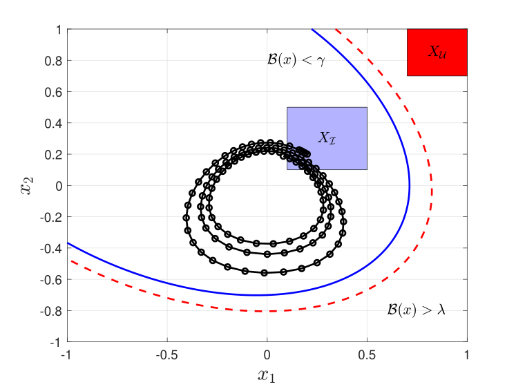
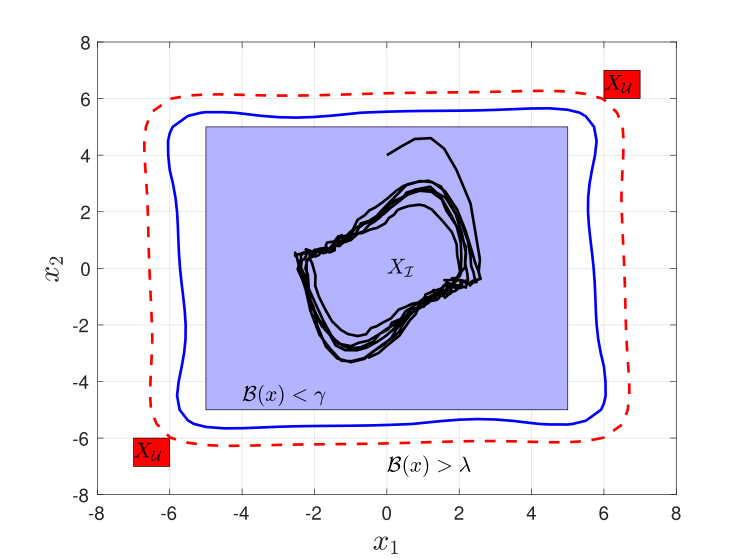
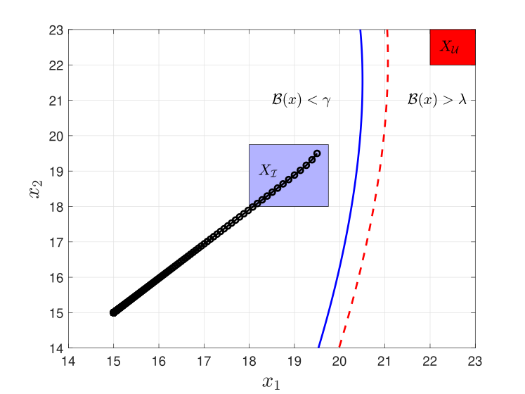
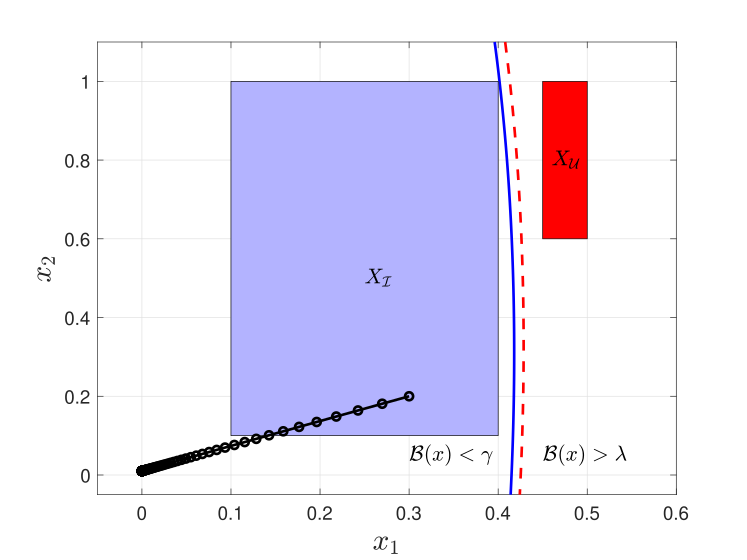
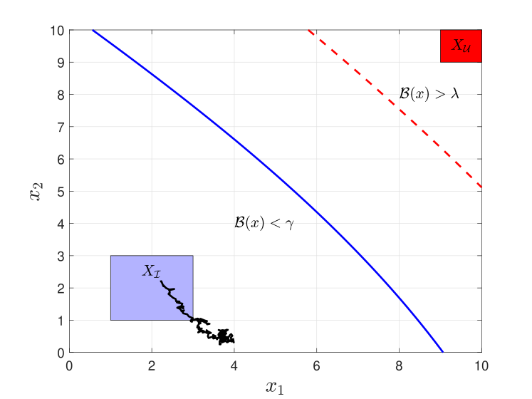

Examples
========

PRoTECT includes benchmark examples for all four system types. Pre-configured
GUI files are available in ``ex/GUI_config_files/`` and can be imported via the
**Import Config** button in the GUI.

All example scripts are in the ``ex/`` directory.

----

Jet Engine --- ct-DS
--------------------

A 2D continuous-time deterministic jet engine system verified over an infinite
time horizon. The goal is to prove the system never reaches the red unsafe region.

**Source:**
`ex2_jet_engine_ct_DS.py <https://github.com/Kiguli/PRoTECT/blob/main/ex/benchmarks-deterministic/PRoTECT-versions/ex2_jet_engine_ct_DS.py>`_

----

Van der Pol Oscillator --- dt-SS
--------------------------------

A 2D discrete-time stochastic Van der Pol oscillator verified over a finite time
horizon with uniform noise. The goal is to bound the probability of reaching the
red unsafe region.

**Source:**
`ex2_van_der_pol_oscillator_dt_SS_uniform.py <https://github.com/Kiguli/PRoTECT/blob/main/ex/benchmarks-stochastic/Table%202%20-%20Single%20Runs/ex2_van_der_pol_oscillator_dt_SS_uniform.py>`_

----

Two-Room Temperature --- dt-DS
-------------------------------

A 2D discrete-time deterministic two-room temperature system verified over an
infinite time horizon.

**Source:**
`ex2_TwoRoomTemp_dt_DS.py <https://github.com/Kiguli/PRoTECT/blob/main/ex/benchmarks-deterministic/PRoTECT-versions/ex2_TwoRoomTemp_dt_DS.py>`_

----

Linear and Nonlinear 2D Systems --- ct-SS
-----------------------------------------

Two continuous-time stochastic systems (linear and nonlinear) verified over a
finite time horizon.

.. grid:: 1 2 2 2
   :gutter: 3

   .. grid-item::

      .. image:: ../figs/Linear2.png
         :width: 100%
         :alt: 2D Linear System (ct-SS)

      **Linear system** ---
      `ex2_A1linear_ct_SS.py <https://github.com/Kiguli/PRoTECT/blob/main/ex/benchmarks-stochastic/Table%202%20-%20Single%20Runs/ex2_A1linear_ct_SS.py>`_

   .. grid-item::

      .. image:: ../figs/Nonlinear2.png
         :width: 100%
         :alt: 2D Nonlinear System (ct-SS)

      **Nonlinear system** ---
      `ex2_nonlinear_ct_SS.py <https://github.com/Kiguli/PRoTECT/blob/main/ex/benchmarks-stochastic/Table%202%20-%20Single%20Runs/ex2_nonlinear_ct_SS.py>`_

----

DC Motor --- dt-DS
------------------

A 2D discrete-time deterministic DC motor system.

**Source:**
`ex2_DC_Motor_dt_DS.py <https://github.com/Kiguli/PRoTECT/blob/main/ex/benchmarks-deterministic/PRoTECT-versions/ex2_DC_Motor_dt_DS.py>`_

----

Two-Tank System --- dt-SS
-------------------------

A 2D discrete-time stochastic two-tank system.

**Source:**
`ex2_two_tanks_dt_SS.py <https://github.com/Kiguli/PRoTECT/blob/main/ex/benchmarks-stochastic/Table%202%20-%20Single%20Runs/ex2_two_tanks_dt_SS.py>`_

----

More Examples
-------------

Additional benchmarks, including high-order systems (4D, 6D, 8D), are available
in the repository:

- **Deterministic:** ``ex/benchmarks-deterministic/PRoTECT-versions/``
- **Stochastic (single runs):** ``ex/benchmarks-stochastic/Table 2 - Single Runs/``
- **Stochastic (parallel runs):** ``ex/benchmarks-stochastic/Table 3 - Parallel Runs/``
- **ARCH-COMP competition:** ``ex/ARCH-COMP/``
